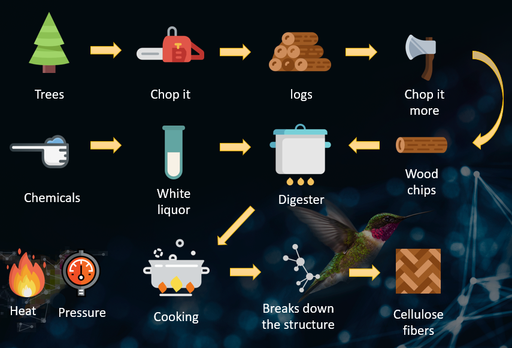
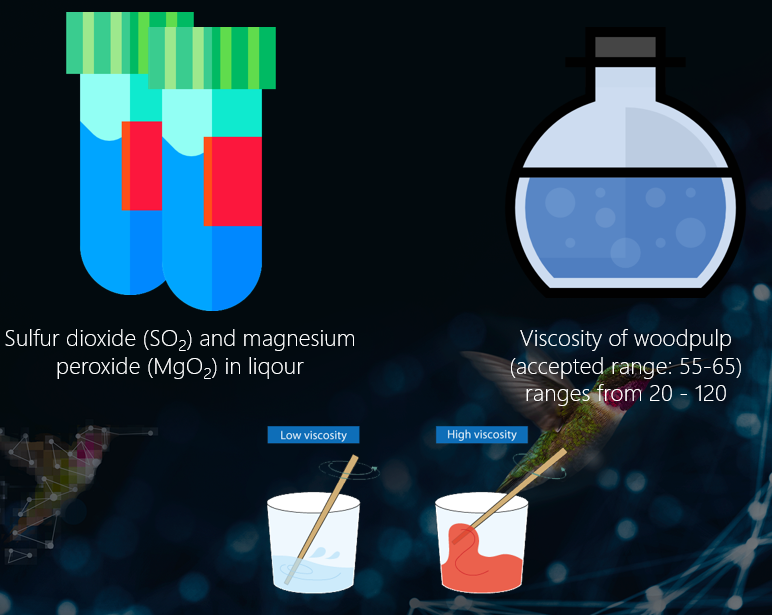
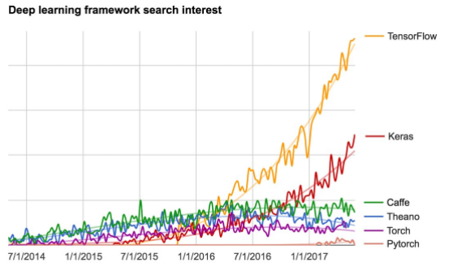
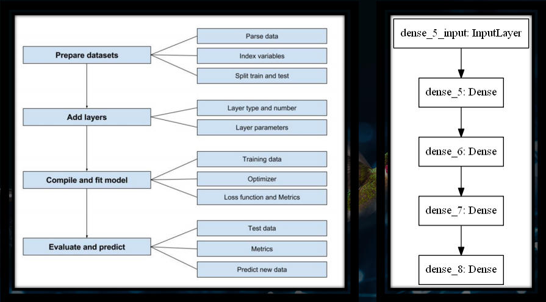
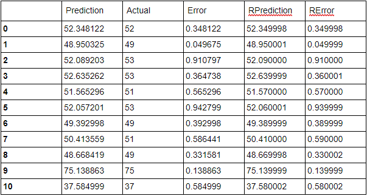
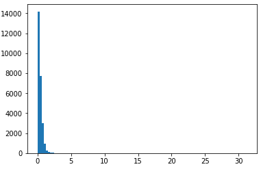

# From wood to paper with AI - A technical case study

Making quality paper is not as easy as it might sound. There are numerous tasks that needs to be conducted in the right manner at the right time of the process. Having one of these tasks going wrong, can lead up to a lot of hassle as the paper manufacturing process needs to be within a set of guidelines in order to produce paper that lives up to standard.

Microsoft joined up with a multinational company in South Africa with a goal of incorporating smarter ways of creating high quality paper. By using techniques from the world of Artificial Intelligence, we managed to come up with a solution that helps the paper manufacturing process by early on predicting key factors on how the paper outcome is going to result before the process is actually finished. Not only will it save the company tons of money as they no longer have to use excessive amounts of expensive chemicals in order to correct the outcome of the paper, but the techniques used will also be able to save the environment since more wood will get utilized more efficiently.

The team from Commercial Software Engineering (CSE) at Microsoft:

| Name        | Role           |
| ------------- |:-------------:|
| Simon Jäger      | Technical Evangelist |
| Anders Gill      | Technical Evangelist |

## The paper making process

In order to make paper, wood chips are put into a vessel called a “digester”. Into the digester, white liquor is poured. White liquor, a mix of various sodium-based chemicals, is used to dissolve the lignin. At the end of the process, the white liquor is converted to black liquor – a mixture of sodium, sulfur, lignin and other dissolved wood compounds. The right temperature and pressure is needed in order to break down the structure of the wood to make cellulose. Lignin, the material in trees that binds wood together, must be separated from the cellulose to create the pulp quality necessary for making fine paper. After cooking the wood chips, the cellulose fibers that are released become the pulp used for making paper.



## Key technologies

* Jupyter Notebook running Python
* Microsoft Azure Data Science Virtual Machines for computational power

Libraries consisted of: 

* Pandas
* numpy
* Keras
* Tensorflow
* SKLearn
* Matplotlib
* Seaborn

## The aim of the hackfest - problem statement

There were two main goals for the hackfest, both challenges were centered towards predicting numeric values that would help the manufacturing process of paper.

The first challenge was to predict a numeric value for the Sulfur dioxide (SO2) based upon data from the liquor quality that goes into the digester. In specific, a chemical used in the digester that helps to dissolve the binding between the ligning and the wood - the white liquor. Having a higher liquor quality, should in theory result in a higher pulp quality. The second challenge was to predict the actual viscosity that would give an estimated number of the end pulp quality. 

The end goal is to have a viscosity that is between a lower and upper-threshold. If the viscosity value lands between these thresholds; less expenses are to be used on chemicals post cooking in order to correct the color and other factors of the pulp that will eventually yield high quality paper after it has been further processed. Corrections to the viscosity can also be made earlier in the pipeline if we are able to predict the end viscosity earlier on, saving more woods from being processed into paper because of higher utilization rate.



## Solution, steps, and delivery

The first step is as always to try and understand as much as possible about the domain before jumping into the data and start building models. We performed an exploratory data analysis (EDA) on the data at hand after having looked at all the plant process flows and contextualized as much logic as possible to understand the scenario further. The data consisted of one year’s worth of per minute liquor plant readings which resulted in 8000 rows/150 columns of data. Having looked at the data, gone back and forth a couple of rounds with questions to the domain experts; we decided that we were ready to develop our machine learning models and see if we could predict the SO2 before jumping on to viscosity later on which is further down the process chain.

---

Below is a summary of the things we tried to do in order to predict both the SO2 and the viscosity.

Ordered list of steps, starting with classical Machine Learning:

| Attempt        |
| ------------- |
| 1. Removed multiple Dependent Variables (DV) as we only wanted to keep one at a time to bypass interference. |
| 2. Cleaned data: Removed dates, timestamps and other non explaining columns, removed features that we know shouldn’t matter or have any predictive power, removed columns with recurring values and without numerical data types or mixed data types. Removed and replaced nulls with eg. mean. |
| 3. Computed pairwise correlation between columns and the DV by the use of the Pearson method. |
| 4. Splitted the data into train/test. Tried different splits; 67/33, 80/20, 95/5 |
| 5. Scaled data |
| 6. PCA dimensionality reduction (150 => 2) and looked at how much of the variance was kept |
| 7. Modeled 2 dimensions x 8000 rows with Linear Regression and assessed the R-Squared |
| 8. Modeled Support Vector Regression (SVR) and assessed the R-Squared |
| 9. Modeled Random Forest Regressor and assessed the R-Squared |
| 10. Generated descriptive statistics that summarized the central tendency, dispersion and shape of the errors |
| 11. Modeled Gradient Boosted Regression with GridSearch parameters on n_estimators: 
50, 100, 150, Max_features: 10, 20, 50, loss: ls, lad, huber, quantile and evaluated with cross validation on the mean (R-Squared) of 3 folds (fitted 3 folds for each 60 candidates, totalling 180 fits) |
| 12. Modeled Extra Trees Classifier and yielded a feature importance score for each column where we selected the ones with a high score compared to the rest |
| 13. Modeled Recursive Feature Elimination (RFECV) with cross validation on 5 folds. Selected the features based on the rankings of the RFECV |
| 14. Used the Variance Threshold Features Selection method to remove all low-variance features |
| 15. Decided to look at the problem as a classification problem and made efforst towards finding clusters |
| 16. Plotted the data after Principal Component Analysis (PCA) reduction into 2 dimensions from 150, and looked for correlation/pattern in a plotted scatterplot |
| 17. Plotted the columns as histograms, and ranked the number of unique values in columns |
| 18. Outputted Pearson correlation on all columns and looked for patterns |
| 19. Fired up Azure Machine Learning Studio and tried the following algorithms:
Poisson regression, Fast Forest Quantile Regression, Linear Regression, Bayesian Linear Regression, Neural Network Regression, Decision Forest regression and Boosted Decision Tree regression |
| 20. Tried Filter Based Feature Selection with the following algorithms:
Pearson, Mutual information, Kendall, Spearman, Chi Squared, Fisher and Count based |

Ordered list of steps on Deep Learning:

| Attempt        |
| ------------- |
| Started to exhaust our classical machine learning skills. Decided to bring up the big guns and modeled a dense sequential neural network in Tensorflow through Keras with Keras Regressor on both wide and deep graphs. Achieved surprisingly good results. |
| Tried to optimize the neural network with the following parameters: Activation functions: relu, tanh, sigmoid, softmax. Optimizers: adam, rmsprop, sgd. Epochs: 20, 50, 100, 150, 200, 250. Batch sizes: 5, 10, 15, 20, 25, 50 |
| Tried on both GPU and CPU with fallback to CPU |
| Holdout: decreased size for test from 20% to 5% as more data was needed for the DNN |
| Described the error and looked at prediction vs actual. |
| Looked at mean/max (suggested outliers were causing max to peak).|
| Plotted distributions of errors. |
| Dumped model with h5py |
| Pickled scalar |
| Evaluated with cross validation on each 7 candidates, totalling 14 fits on batch_size = [5, 10, 15], epochs = [10, 15, 20] |
| Tried corrwith function on all columns |
| Modeled with Extra Trees Classifier and looked at mean/man and tried to beat the DNN without success |
| Tried the same DNN model on predicting viscosity and outputted histogram with the distribution of errors |
| Created a manual Grid Search for the DNN with multiple parameters: d_out = [20, 10, 5, 2, 1] d_act = ['relu', 'sigmoid', 'softmax', 'softsign'] batch_sizes = ['adam', 'sgd', 'rmsprop'] losses = ['mean_squared_error', 'squared_hinge', 'logcosh', 'poisson'] |
| Tried to plot predictions vs errors on a scatter plot |
| Visualized learning through TensorBoard |
| Generated schema file as json with the generate_schema function so that we could upload it to Azure Model Management with the pickled scalar and the h5py model. |


### General design of how Keras works

Keras is increasingly gaining popularity as one of the easiest and best deep learning frameworks for beginners to use that works on top of Tensorflow. This is one of the reasons why we decided to pursue Deep Learning through Keras as we needed to prototype fast, have good extensibility without having to invest everything into learning TensorFlow in a short period of time and risking not getting the results we wanted.



Source: @fchollet, June 3 - 2017 

**Keras steps**

**1.**	Prepare your input and output tensors

**2.**	Create first layer to handle input layer

**3.**	Create last layer to handle output targets

**4.**	Build any model you like in between

Source: Deep Learning Using Keras - Aly Osama 30 August 2017  



**1. Sequential model (a linear stack of layers)**

```
from keras.models import Sequential 
model = Sequential() 

from keras.layers import Dense, Activation 

model.add(Dense(units=64, input_dim=100)) model.add(Activation('relu')) model.add(Dense(units=10)) model.add(Activation('softmax'))
```


**2. Compile model**
```
model.compile(loss='categorical_crossentropy', 
              optimizer='sgd', 
              metrics=['accuracy'])


Also, you can further configure your optimizer

model.compile(loss=keras.losses.categorical_crossentropy, optimizer=keras.optimizers.SGD(lr=0.01, momentum=0.9)) 
```

**3. Training**
```
model.fit(x_train, y_train, epochs=5, batch_size=32) 

You can feed data batches manualy 

model.train_on_batch(x_batch, y_batch) 
```

**4. Evaluation**
```
loss_and_metrics = model.evaluate(x_test, y_test, batch_size=128)
```

**5. Prediction** 
```
classes = model.predict(x_test, batch_size=128) 
```

### The winning model

Summary of the winning model

We started off with all the necessary imports for the neural network, we then configured our device so that it would run on a particular processor (either CPU or GPU). The pre model architecture for our project consisted of reading the data, taking care of missing data, selecting the dependent variable as well as dropping the other dependent variables to bypass interference. Thereby, we removed all the columns we didn’t want, removed features with recurring values and removes features without a numerical data type or mixed data types. 

We split the data with 4% data allocation for test and started to build the graph.
the input layer of our fully connected dense model had the length of the X columns as an input with a kernel initializer as normal and an activation function of RELU at the first hidden layer with 40 neurons. The second hidden layer had 30 neurons and the third and last hidden layer had 15 neurons; all with the activation function of RELU. The output layer has 1 neuron which gives us the final number of the viscosity. 

When compiling the model, we chose Mean Squared Error (MSE) as the loss function and optimizer as ADAM. The ADAM optimization algorithm is an extension to stochastic gradient descent that has recently seen broader adoption in deep learning use cases. ADAM is simply a procedure to update network weights iterative based in training data. For the metric of our model, we chose “accuracy”.

We then decided to create estimators and a pipeline where we scaled through the use of “standardize” and appended a Keras Regressor estimator of “MLP (Multi Layer Perceptron)” with 250 epochs, batch size of 20 with the main graph function as the input for the build.

We then fit the pipeline with X_train and y_train.

After the neural network has trained successfully, we output a table with the predictions vs actuals and take a closer look at the central tendency, dispersion and shape of the errors with the use of the “describe” function on the dataframe.

At last we calculate the mean of the actuals, plot a histogram of the errors and calculate the final accuracy percentage of the model.

### The Deep Neural Network in code
```
Imports

import keras
import pandas as pd
import numpy as np
from sklearn.model_selection import train_test_split
from sklearn.preprocessing import StandardScaler
from sklearn.pipeline import Pipeline
from sklearn.model_selection import cross_val_score
from keras.models import Sequential
from keras.layers import Dense
from keras.wrappers.scikit_learn import KerasRegressor
from tensorflow.python.client import device_lib
import keras.backend.tensorflow_backend as K
from keras.optimizers import SGD
from keras.utils import plot_model

Configuring the device
# Print Devices
print(device_lib.list_local_devices())

# Select Device
DEVICE = '/cpu:0'

Reading the data
# Read Data
df = pd.read_csv('DigesterData for Hackfest - March 2017.csv')
# Taking care of missing data
def myfillna(series):
   if series.dtype is pd.np.dtype(float):
       return series.fillna(series.mean())
   elif series.dtype is pd.np.dtype(object):
       return series.fillna('.')
   else:
       return series
df = df.apply(myfillna)
# Select the Dependent vairable
dv = 'LAB_Viscosity'
# Drop other Dependent Vars
#df = df.drop(['Viscosity', 'SO2Hourly'], axis=1)
# Get X and y
X = df.loc[:,df.columns != dv]
y = df.loc[:, df.columns == dv][dv]


Cleaning the data
for column in X.columns:
   # Remove the columns that we dont want
   if (column in ['Sequence_Step','Cook_Number','Chip_Hi_Level_Switch'
                  ,'CookID','DCS_1_Hour_MgO_Test','DCS_1_Hour_SO2_Test','Liquor_Discharged'
                  ,'Raw_Cook_Number','S_Factor_Calc','Wood_Moisture','Shifts','CookProfileNumber']):
       print ('Removing "{}".'.format(column))
       X = X.drop(column, axis=1)
       continue
       
   # Remove features with recurring values
   if (pd.Series.nunique(X[column]) <=1 ):
       print ('Removing "{}".'.format(column))
       X = X.drop(column, axis=1)
       continue
       
   # Remove features without a numerical datatype , or mixed data types
   dtype = X[column].dtype
   if (dtype != 'int64' and dtype != 'float64'):
       print ('Removing "{}".'.format(column, dtype))
       X = X.drop(column, axis=1)
       continue

Splitting the data
X_train, X_test, y_train, y_test = train_test_split(
   X, y, test_size=0.4, random_state = 42)


Building the graph
# Build function
def get_model():
   # Create the model
   model = Sequential()
   model.add(Dense(40, input_dim=len(X.columns), kernel_initializer="normal", activation="relu"))
   model.add(Dense(30, activation="relu"))
   model.add(Dense(15, kernel_initializer="normal", activation="relu"))
   model.add(Dense(1, kernel_initializer="normal"))
   # Compile model
   model.compile(loss="mean_squared_error", optimizer="adam", metrics= ['accuracy'])
   return model

Create estimators and pipeline
# Set random Seed
np.random.seed(10)
# Create estimators and pipeline
estimators = []
estimators.append(('standardize', StandardScaler()))
estimators.append(('mlp', KerasRegressor(build_fn=get_model, epochs=250, batch_size=20, verbose=2)))
pipeline = Pipeline(estimators)

Setting device session

with K.tf.device(DEVICE):
   #Set Session  K.set_session(K.tf.Session(config=K.tf.ConfigProto(allow_soft_placement=True, log_device_placement=True)))    
   #Fit Pipeline
   pipeline.fit(X_train.as_matrix(), y_train.as_matrix())
plot_model(get_model, to_file='model.png')    


Getting predictions
preds = pipeline.predict(X_test.as_matrix())

p_df = pd.DataFrame()
p_df['Prediction'] = preds
p_df['Actual'] = y_test.as_matrix()
p_df['Error'] = np.abs(p_df['Actual'] - p_df['Prediction'])
p_df['RPrediction'] = np.round(preds,2) 
p_df['RError'] = np.abs(p_df['Actual'] - p_df['RPrediction'])

print(p_df['Error'].describe())

p_df
```

**Output of predictions for viscosity (Goal between: 55 - 65)**



```
Calculating mean
p_df['Actual'].mean()

Output: 52.35879017013232


Plotting errors

import matplotlib.pyplot as plt

plt.hist(p_df['Error'], bins=100)
plt.show()
```

**Output chart:**
 


```
Calculating Accuracy percentage
p_df['Error'].mean()/p_df['Actual'].mean()*100

Output: 0.7064380535244342
```

### Other output attempts

#### Clustering


#### Corr-Pair Plot


#### ML Studio 


